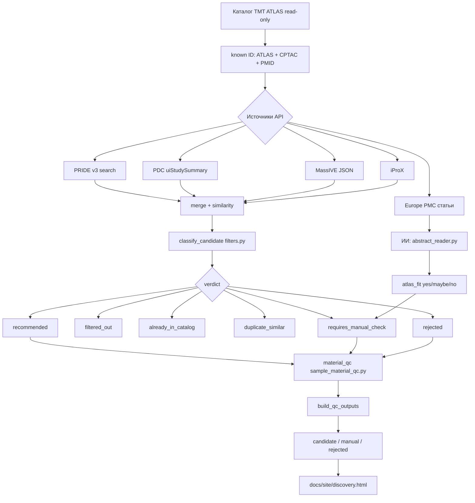

# Discovery Agent — воронка, команды, ИИ

Каталог **только читается** (`project of Proteomics.xlsx`, лист **TMT ATLAS**).  
Агент **не меняет** Excel и не удаляет проекты.

---

## Команды

| Команда | Файл | Что делает |
|---------|------|------------|
| `python run_discovery.py scan` | `run_discovery.py` → `agent.run_discovery_scan` | Полный цикл: поиск → фильтры → QC → отчёт + сайт |
| `python run_discovery.py latest` | `discovery/history.py` | Последний JSON-скан |
| `python run_discovery.py history` | `discovery/history.py` | Список прошлых сканов |
| `python run_discovery.py profile` | `discovery/catalog_profile.py` | Профиль атласа (органы, болезни, TMT) |
| `python run_discovery.py policy` | `discovery/policy.py` | Правила read-only |
| `python run_discovery.py publish` | `viz/publish_site.py` | Пересобрать `docs/site/` |
| `python run_discovery.py llm` | `llm_client.resolve_engine` | Какой ИИ сейчас активен |
| `streamlit run discovery_app.py` | `discovery_app.py` | UI в браузере |
| `powershell scripts\serve_site.ps1` | — | Локальный сайт :8765 |
| `powershell scripts\setup_github_pages.ps1` | — | Первый push на GitHub Pages |
| `powershell scripts\push_site_github.ps1` | — | Обновить сайт на GitHub |

---

## Воронка (от API до сайта)



### Шаг 1 — Поиск (`pro_search.discover_projects_professional`)

| Источник | Модуль | Отсечка до фильтров |
|----------|--------|---------------------|
| **PRIDE** | `sources/pride.py` | human + TMT, год, не в `known` |
| **PDC** | `sources/pdc.py` | TMT **10/11/12/16** only, не TMT6/TMT18, не CPTAC program, не в `known` |
| **MassIVE** | `sources/massive.py` | TMT keywords, не в `known` |
| **iProX** | `sources/iprox.py` | TMT keywords |
| **Europe PMC** | `literature_watch.py` + `abstract_reader.py` | TMT + patient + proteomics; **без** поиска PXD в тексте |

### Шаг 2 — ИИ и абстракты (`abstract_reader.py`)

- Берёт **8 примеров** из вашего TMT ATLAS (`catalog_profile.build_atlas_semantic_context`).
- Читает title + abstract **по смыслу**: пациенты, TMT, tumor/plasma.
- **Не ищет** PXD/PDC/PRIDE в абстракте (`abstract_resolve_accessions: false`).
- Выход: `atlas_fit`, `atlas_fit_score`, `organism`, `tmt`, `material`, `summary_ru`.
- Статьи yes/maybe без проекта → **manual check** (ручной поиск датасета).

### Шаг 3 — Классификация (`filters.classify_candidate`)

Каждый проект получает `verdict`:

| verdict | Условие (код) |
|---------|----------------|
| `already_in_catalog` | PXD/PDC/PMID уже в TMT ATLAS / CPTAC |
| `filtered_out` | не human, не TMT 10–16, label-free, обзор без ID |
| `duplicate_similar` | очень похож на проект в каталоге (Jaccard) |
| `requires_manual_check` | неясный материал / органоиды+ткань / статья по смыслу |
| `rejected` | organoid-only, PDX-only, mouse, MSC и т.д. |
| `recommended` | прошёл все технические фильтры |

### Шаг 4 — QC материала (`sample_material_qc.py`)

Поверх `recommended` / `manual` / `rejected`:

| qc_status | Смысл |
|-----------|--------|
| **candidate** | tumor/adjacent/plasma/cancer cell line — OK для атласа |
| **requires_manual_check** | смешанный дизайн, неясно |
| **rejected** | organoid-only, PDX-only, не-human |

### Шаг 5 — Выход

- **candidate** → `docs/site/discovery.html` (только новые PXD/PDC/MSV/IPX)
- **manual_check** / **rejected** → QC-таблицы на сайте
- Каталог на сайт **не** попадает

---

## ИИ: Z.AI (GLM), Qwen, Claude или локально

Настройка: `config.yaml` → `llm.provider: auto`, ключи в `.env` (см. `.env.example`).

Цепочка выбора (`llm_client.resolve_engine`) при `prefer_cloud: true`:

```
auto →
  1. Z.AI (GLM)              если ZAI_API_KEY
  2. Qwen Cloud              если DASHSCOPE_API_KEY / QWEN_API_KEY
  3. Claude                  если ANTHROPIC_API_KEY
  4. Ollama (qwen2.5:3b)     если ollama serve запущен
  5. GPT4All (Qwen2-1.5B)    локально, ~1 GB
  6. local_rules (regex)     если ничего нет
```

При `prefer_cloud: false` сначала Ollama → GPT4All, затем облако.

| Движок | Модель | Ключ / условие |
|--------|--------|----------------|
| **Z.AI (GLM)** | `glm-4-flash` | `ZAI_API_KEY` — [z.ai](https://z.ai) → API Keys |
| **Qwen Cloud** | `qwen-plus` | `DASHSCOPE_API_KEY` |
| **Claude** | `claude-sonnet-4-6` | `ANTHROPIC_API_KEY` |
| **Ollama** | `qwen2.5:3b` | локально, без ключа |
| **GPT4All** | `qwen2-1_5b-instruct-q4_0.gguf` | fallback без интернета |
| **regex** | правила | `llm.enabled: false` или нет движка |

Проверить активный движок:

```bash
python run_discovery.py llm
python run_discovery.py llm --test   # тестовый запрос к API
```

Включить Z.AI (рекомендуется):

```bash
# .env
ZAI_API_KEY=your-key-from-z.ai
```

```yaml
llm:
  provider: auto          # или zai
  prefer_cloud: true
  model: glm-4-flash
  base_url: https://api.z.ai/api/paas/v4
```

Переключить на Claude (если есть ключ):

```yaml
llm:
  provider: claude
  model: claude-sonnet-4-6
```

Переключить на Ollama Qwen:

```bash
ollama pull qwen2.5:3b
ollama serve
```

```yaml
llm:
  provider: ollama
  model: qwen2.5:3b
```

### Что именно делает ИИ в Discovery

**Только чтение абстрактов** (`abstract_reader.read_abstract_with_llm`):

1. Получает контекст ваших 123 проектов (few-shot).
2. Оценивает: подходит ли статья под human TMT atlas.
3. Отклоняет TMT6 / organoid-only / mouse.
4. Пишет краткий `summary_ru`.

ИИ **не** добавляет проекты в каталог и **не** ищет PXD автоматически.

---

## Ключевые файлы

| Путь | Роль |
|------|------|
| `run_discovery.py` | CLI |
| `atlas_agent/discovery/agent.py` | Оркестратор скана |
| `atlas_agent/discovery/sources/pro_search.py` | PRIDE + PDC + статьи |
| `atlas_agent/discovery/abstract_reader.py` | ИИ-абстракты |
| `atlas_agent/discovery/filters.py` | Воронка verdict |
| `atlas_agent/discovery/sample_material_qc.py` | QC материала |
| `atlas_agent/discovery/qc_outputs.py` | candidate / manual / rejected |
| `atlas_agent/sources/pdc.py` | PDC TMT10+ фильтр |
| `atlas_agent/llm_client.py` | Выбор Qwen / Claude / GPT4All |
| `config.yaml` | discovery + llm + pdc |

---

## GitHub

Код на GitHub появится после:

```powershell
gh auth login
powershell -File scripts\setup_github_pages.ps1
```

Сайт: `https://arinaatom-cyber.github.io/ai-for-atlas/site/discovery.html`

Тесты: `python -m pytest tests/ -q` (20 тестов: QC + PDC + semantic).
